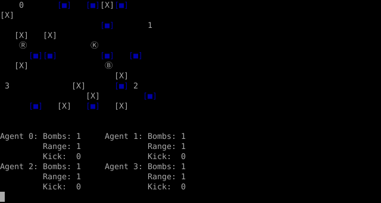

# Multi-Agent Reinforcement Learning @ NIPS 2018

This repository is an open-source implementation of a Multi-Agent Reinforcement Learning Agent that will participate in the NIPS 2018 [Pommerman challenge](https://www.pommerman.com/). For a full list of availble competitions this year at the NIPS conference, see the [competition track](https://nips.cc/Conferences/2018/CompetitionTrack).

This is how the C++ backend currently looks like: 



## Prerequisites

To compile and run this project from source you will require

- Linux Distribution (Tested on Ubuntu 18.04)
- GCC 7.3.0
- MAKE 4.1
- CUDA 9 (not yet necessary, will be updated)

## Setup

This project uses the [playground environment](https://github.com/MultiAgentLearning/playground) as a submodule. To fully clone the repository use
```
# git version 2.13+
$ git clone --recurse-submodules https://github.com/m2q/nips2018-agent.git

# for Git version 2.12 or less
$ git clone --recursive https://github.com/m2q/nips2018-agent.git
```
To **compile** the main application and run it use `./run.sh` (alternatively you can `make main` and the binary will be in /bin).

To test the project use `./test.sh` (or `make` and execute `./bin/test`). This project uses a single-header version of the [Catch2 Unit Testing Framework](https://github.com/catchorg/Catch2).

## Project Structure

All of the main source code is in `src/*` and all testing code is in `unit_test/*`. The source is divided into modules

```
src
 |
 |_ _ _ bboard
 |        |_ _ _ bboard.hpp
 |        |_ _ _ ..
 |
 |_ _ _ agents
 |        |_ _ _ agents.hpp
 |        |_ _ _ ..
 |
 |_ _ _ main.cpp
```

All environment specific functions (forward, board init, board masking etc) reside in `bboard`. Agents can be declared
in the `agents` header and implemented in the same module.

All test cases will be in the module `unit_test`. The bboard should be tested thoroughly so it exactly matches the specified behaviour of Pommerman. The compiled `test` binary can be found in `/bin`

| Command | What it does |
| ------- | ------------ |
| `./test`  | Runs all tests, including a performance report |
| `./test "[step function]"` | Tests only the step function  |
| `./test ~"[performance]"` | Runs all test except the performance cases| 

## Defining Agents

To create a new agent you can use the base struct defined in `bboard.hpp`. To add your own agent, declare it in
`agents/agents.hpp`and provide a source file in the same module. For example:

agents.hpp (excerpt)
```C++
/**
 * @brief Uses a hand-crafted FSM with stochastic noise
 */
struct MyNewAgent : bboard::Agent
{
    bboard::Move act(bboard::State* state) override;
};
```

fsm_agent.cpp
```C++
#include "bboard.hpp"
#include "agents.hpp"

namespace agents
{

bboard::Move MyNewAgent::act(bboard::State* state)
{
    // TODO: Implement your logic
    return bboard::Move::IDLE;
}

}
```
## Citing This Repo

```
@misc{Alic2018nips,
  author = {Alic, Adrian},
  title = {Distributed Async MARL Competition Entry},
  year = {2018},
  publisher = {GitHub},
  journal = {GitHub repository},
  howpublished = {\url{https://github.com/m2q/nips2018-agent}}
}

```
